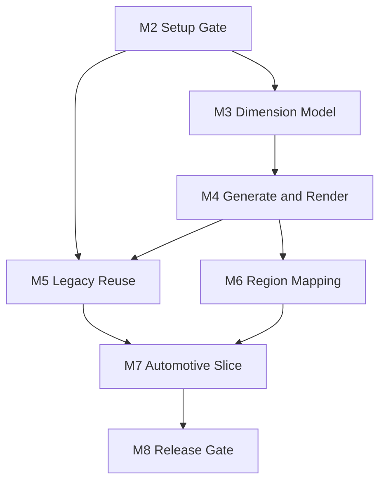

# CAD Agent Approved Design Rollout Implementation Plan

> **For agentic workers:** REQUIRED SUB-SKILL: Use superpowers:subagent-driven-development (recommended) or superpowers:executing-plans to implement this plan task-by-task. Steps use checkbox (`- [ ]`) syntax for tracking.

**Status:** Planned

**Approval date:** 2026-08-02

**Base SHA:** `ca8a768c8e7897c1418d44c810cd295b9139e5bf`

**Completion Head SHA:** Not recorded until the final implementation/evidence commit exists.

**Verification command:** `powershell.exe -NoProfile -ExecutionPolicy Bypass -File .\scripts\verify.ps1`

**Verification result:** Not recorded until execution completes.

**Required private/live gates:** `real_data`: NOT RUN for this planning record; `autocad_mechanical`: NOT RUN for this planning record. The planning workspace had Python 3.12.13 without pytest, so it is not release evidence for this Windows/Python 3.11 project.

**Goal:** Roll out the approved dimension-first, image-guided, profile-controlled CAD Agent design for configurable automotive-conversion work from the repository's verified baseline, without narrowing the product to one conversion example, rewriting working packages, or weakening existing safety gates.

**Architecture:** Preserve the current `primitive_ir_lib -> semantic_ir_lib -> agent_lib -> dxf_builder_lib -> mcp_integration_lib` pipeline and the parallel `CadAgent.AutoCAD2027` dispatcher. Add the missing capabilities as independently reviewable slices: drawing setup, dimension/datum contracts, deterministic operation plans, legacy knowledge, region verification, domain completion, and authoritative release.

**Tech Stack:** Windows, Python 3.11, AutoCAD Mechanical 2027, Tesseract 5.4.0.20240606, ezdxf 1.4.x, python-solvespace 3.x, .NET 10 (`net10.0-windows`, x64), ObjectARX SDK 2027, JSON/File IPC, SQLite in M5.

## Global Constraints

- Canonical product, architecture, status, quality, and record-policy sources remain `docs/PROJECT.md`, `docs/ARCHITECTURE.md`, `docs/STATUS.md`, `docs/QUALITY.md`, and `docs/superpowers/README.md`.
- The approved design is `docs/superpowers/specs/2026-08-02-cad-agent-complete-design.md` and must be committed before implementation begins.
- Supported release environment remains exactly Windows, Python 3.11, AutoCAD Mechanical 2027, and Tesseract 5.4.0.20240606.
- Existing verified packages and File IPC behavior are preserved; changes require a failing test, benchmark, or measured integration need.
- No schema, solver, operation, component API, or AutoCAD executor may hard-code one vehicle conversion pair or one specific item of equipment. A crane/flatbed example is a pilot fixture only when explicitly selected.
- Existing pixel-first image/PDF commands remain `DRAFT_REFERENCE`; they are not silently promoted to authoritative output.
- Model Space remains millimetres at 1:1; viewport/Layout owns presentation scale.
- PDF/image pixels never resolve model-critical coordinates. Approved dimensions, datums, relations, and reusable components remain authoritative in that order.
- Private drawings, raw audits, customer data, annotations, DWT binaries, and generated DXF/DWG artifacts stay outside Git unless explicitly approved as non-sensitive fixtures.
- No production drawing mutation occurs without exact target identity, verified backup, explicit approval, post-mutation render/measurement, and a passing second review.
- `SECURELOAD=0` is prohibited. AutoCAD code is loaded only from `TRUSTEDPATHS` or an approved signed deployment.
- `scripts/verify.ps1` remains the only authoritative aggregate verifier. A missing live/private prerequisite is `SKIP` or `NOT RUN`, never `PASS`.

---

## Repository Baseline at the Approved Design

| Milestone | Actual state at base SHA | Preserve | Remaining delta |
|---|---|---|---|
| M0 — contracts/safety | Substantially verified | SHA-bound manifests, resume refusal, approval records, backup/rollback, second review | Add approved global run states/error codes and provenance/setup manifests without breaking current manifests |
| M1 — .NET dispatcher | Verified for managed disposable scope | `CADAGENT_HEALTH`, `CADAGENT_DISPATCH`, `CADAGENT_REVIEW`, `CADAGENT_CLOSE_DISPOSABLE`, `dotnet_ipc`, full-path identity | Add read-only drawing-standard/setup audit; later add measure/render/affected-region evidence through compatible operations |
| M2 — drawing initialization | Not implemented as a gate | Existing environment and File IPC foundations | Drawing Definition/Profile/Domain Pack/DWT registry, setup plan, AutoCAD audit, `SETUP_VERIFIED`, font policy, candidate-DWG audit |
| M3 — dimension/datum/constraint | Partially implemented | Generic constraints, pruning, solve results, confirmed native linear dimensions | Authoritative Dimension IR attachments, Datum IR, provenance/status, residual/conflict register, model-critical DOF gate |
| M4 — deterministic generation/render | Partially implemented | ezdxf builder, handles, headless review, native dimensions/components | Business-level Operation Plan, static validation, mutation-to-region mapping, render hash, measurement round-trip |
| M5 — legacy knowledge/reuse | Not implemented as a product subsystem | Existing DWG inspection evidence and semantic components | DWG/DXF analyzer, SQLite index, similarity, component registry, parameter/provenance validation |
| M6 — source/CAD regions | Partially implemented in private fidelity workflow | Hash-bound crops, approvals, overlays, review queues | Generic view segmentation, semantic regions plus coverage grid, source/CAD/entity/dimension mapping, shared-datum checks |
| M7 — domain-complete repair | Partially implemented | Automotive-like components, review-only fidelity extensions, safe live repair boundary | Multi-view automotive Domain Pack, native annotation/hatch/font policies, draft repair plan with re-render/re-measure |
| M8 — release gate | Partially implemented | Mechanical review/repair safety loop, fidelity promotion evidence | Generic Region Verification Register, stale-evidence enforcement, coverage/global review, authoritative Release Manifest |

## Reuse-First Execution Policy

Before implementing any task, the PO and implementer must inspect the fresh
`main`, `docs/STATUS.md`, existing tests, package APIs, and the task's declared
write set. Classify every requested capability as one of:

1. `REUSE_AS_IS`: verified behavior already satisfies the contract;
2. `EXTEND_WITH_TEST`: the current boundary is correct and needs a bounded,
   backward-compatible addition;
3. `NEW_MISSING_CAPABILITY`: no existing implementation or safe extension
   point exists.

Prefer the first two classes. Do not introduce a parallel pipeline, duplicate
schema, second solver, alternate dispatcher, or replacement package merely
because a plan originally said `Create`. If the file or behavior exists on the
fresh execution base, review and extend it instead of overwriting it. Every
task report must list what was reused, what was extended, what was newly added,
and the evidence that justified each new addition.

## Required Plan Decomposition

The approved design spans independent subsystems. Execute it as the following plans; do not open M3 implementation before the M2 acceptance gate is closed.

| Order | Executable plan | Deliverable | Predecessor |
|---:|---|---|---|
| 1 | `2026-08-02-m2-drawing-initialization-gate.md` | Read-only Drawing Setup contracts, profile/template provenance, AutoCAD audit, and `SETUP_VERIFIED` evidence | Approved design at base SHA |
| 2 | `2026-08-02-m3-dimension-datum-constraint.md` | Dimension IR, Datum IR, Constraint IR, approval register, conflict/residual gate | M2 PASS |
| 3 | `2026-08-02-m4-operation-plan-render-feedback.md` | Business Operation Plan, native deterministic generation, affected-region render and measure loop | M3 PASS |
| 4 | `2026-08-02-m5-legacy-knowledge-reuse.md` | DWG/DXF audit index, SQLite similarity, component registry and reusable operations | M2 PASS; M4 contracts stable |
| 5 | `2026-08-02-m6-view-region-mapping.md` | View segmentation, source/CAD mapping, semantic regions and coverage grid | M3 and M4 PASS |
| 6 | `2026-08-02-m7-automotive-domain-repair.md` | Configurable multi-view automotive conversion reconstruction, cross-configuration proof, and disposable repair loop | M4–M6 PASS |
| 7 | `2026-08-02-m8-authoritative-release-gate.md` | Region register, stale-evidence detection, global/plot review and production release manifest | M7 PASS |

Only the first plan is detailed now. Each later plan is written against the fresh integration SHA and `docs/STATUS.md` after its predecessor passes; this prevents future plans from assuming file names or APIs that the preceding implementation changed.

## Cross-Milestone Interfaces

The following names are stable design contracts and must not drift between plans:

```python
class DrawingSetupError(ValueError): ...

def require_setup_verified(
    evidence: Mapping[str, object],
    *,
    setup_plan_sha256: str,
    drawing_profile_sha256: str,
    template_file_sha256: str,
) -> None: ...
```

```python
@dataclass(frozen=True)
class DimensionObservation:
    id: str
    value: float
    unit: str
    kind: str
    view_id: str
    from_ref: str
    to_ref: str
    role: str
    status: str
    provenance: str
```

```python
@dataclass(frozen=True)
class SolvedDrawingModel:
    model_id: str
    setup_evidence_sha256: str
    dimensions_sha256: str
    datums_sha256: str
    constraints_sha256: str
    solved_views: Mapping[str, object]
```

```python
@dataclass(frozen=True)
class ValidatedOperationPlan:
    run_id: str
    solved_model_sha256: str
    setup_evidence_sha256: str
    operations: tuple[Mapping[str, object], ...]
    affected_region_ids: tuple[str, ...]
```

Later plans may extend these records by versioning their schemas; they must not redefine the same field under a different meaning.

## Milestone Lifecycle

For every milestone:

- [ ] Write its approved spec delta and executable plan with `Status`, `Base SHA`, verification command, and required live/private gates.
- [ ] Create a task branch/worktree from the recorded base SHA.
- [ ] Write a failing focused test before production behavior.
- [ ] Implement the smallest passing change without unrelated refactors.
- [ ] Run focused tests and inspect the task diff.
- [ ] Commit the bounded task.
- [ ] Run `scripts/verify.ps1` on Windows from a clean integration tree.
- [ ] Run `real_data` and/or `autocad_mechanical` only when the task affects those gates.
- [ ] Complete requirements/architecture, correctness/test, and security/operations reviews for geometry, File IPC, AutoCAD, architecture, or release work.
- [ ] Record only fresh evidence in `docs/STATUS.md` and close the plan lifecycle.

## Dependency Gate



## PO Luna Max Execution Handoff

1. Start implementation only after this planning PR is merged. Create the M2
   execution branch from the then-current `main`; compare it with planning base
   `ca8a768c8e7897c1418d44c810cd295b9139e5bf` and refresh only assumptions
   invalidated by newer runtime commits.
2. Read this rollout first, then execute
   `docs/superpowers/plans/2026-08-02-m2-drawing-initialization-gate.md`.
   Do not start M3 before the M2 acceptance gate closes.
3. Use multiple Luna Max implementers only for tasks whose dependency and
   primary write sets are explicitly disjoint. Each implementer works on an
   isolated task branch/worktree and returns a bounded commit plus verification
   evidence to one integration owner.
4. Use one designated reviewer agent for the program. That reviewer performs
   the required requirements/architecture, correctness/test, and
   security/operations passes sequentially, records concrete findings, and
   reviews the integrated result rather than unmerged worker branches.
5. The integration owner rejects duplicate implementations, unrelated
   refactors, unproven rewrites, stale base assumptions, and any result that
   silently promotes `DRAFT_REFERENCE` output.

The M2 plan contains the exact parallel windows. More agents do not authorize
concurrent edits to the same file or bypass a predecessor gate.

## Final Program Acceptance

- Every design requirement maps to an implemented milestone and evidence record.
- `M0` and `M1` verified behavior remains working throughout.
- The authoritative path refuses geometry before `SETUP_VERIFIED` and refuses release before all M8 gates pass.
- No model-critical object is `ESTIMATED` or `UNRESOLVED` in an authoritative release.
- Every mutation invalidates affected visual evidence and produces a newer render/measurement record.
- Every critical region is verified with post-final-mutation evidence and complete coverage.
- AutoCAD Mechanical output remains native/editable and passes read-only review.
- Production save remains impossible without target, backup, approval, second review, and Release Manifest.
